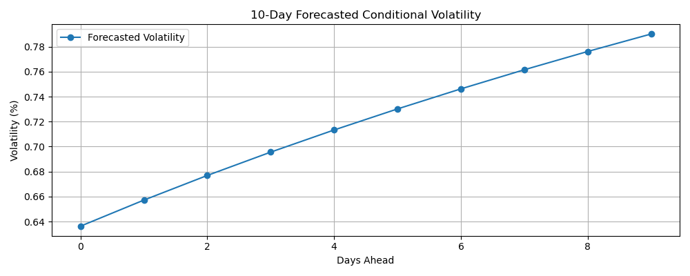

# GARCH Volatility Forecasting

This project uses a **GARCH(1,1)** model to forecast daily return volatility based on historical asset data.  
GARCH models are widely used in finance to model time-varying volatility and volatility clustering, particularly in risk management and derivative pricing.

---

## 🧠 What This Project Does

- Downloads historical price data for an asset (S&P500 by default)
- Calculates daily returns and visualises them
- Fits a **GARCH(1,1)** model to the return series using the `arch` Python package
- Forecasts volatility for future time steps (e.g. next 10 days)
- Plots both historical and forecasted conditional volatility

---

## 📈 Output: Volatility Forecast

The notebook produces:

- A chart of estimated conditional volatility
- A forecast of volatility into the future
- Commentary on volatility spikes and decay patterns



---

## 💡 Interpretation

GARCH helps us understand how volatility evolves over time:
- Periods of high volatility (e.g. crisis periods) lead to **persistence**, where volatility stays elevated.
- Periods of low volatility gradually **mean-revert**.

The forecasted values provide insight into **how uncertain the market is likely to be** in the short term, which is critical for:
- VaR calculations
- Risk-adjusted return modelling
- Option pricing

---

## 🛠️ Tools Used

- Python
- pandas
- yfinance
- matplotlib
- arch

---

## ▶️ How to Run

1. Clone the repo or download the ZIP
2. Open `garch_forecasting.ipynb` in Jupyter or VS Code
3. Install the required libraries:
```bash
pip install pandas yfinance matplotlib arch
